# Comparative Volatility and Performance of UAE and U.S. Stock Markets (2022–2023)
*Exploring how risk, return, and sector behavior differ between two major global markets.*

---

## Project Question

**How do the U.S. and UAE stock markets differ in volatility, returns, and sectoral behavior during 2022–2023, and what does this reveal about market stability, risk, and global interdependence?**

---

## Data

### Sources

This analysis uses daily trading data from four companies representing two sectors—**Banking** and **Energy**—in both **U.S.** and **UAE** markets.

| Market | Sector | Company | Data Source |
|---------|---------|----------|--------------|
| **ADX (UAE)** | Banking | First Abu Dhabi Bank (FAB) | ADX / ADX Exchange |
| **ADX (UAE)** | Energy | Abu Dhabi National Energy Co. (TAQA) | ADX / ADX Exchange |
| **NYSE (U.S.)** | Banking | JPMorgan Chase (JPM) | Yahoo Finance |
| **NYSE (U.S.)** | Energy | ExxonMobil (XOM) | Yahoo Finance |

The dataset contains over **400 trading days** between 2022–2023 with 12+ features, including:  
`Date`, `Company`, `Market`, `Sector`, `Close`, `Open`, `High`, `Low`, `Volume`, calculated `Daily Return`, and categorical `Day_Type`.

Data analysis was performed in **Python** using:  
- `pandas` for cleaning and transformation  
- `numpy` for descriptive statistics  
- `matplotlib` and `seaborn` for visualization  

All figures are stored in the `/graphs/` folder and can be reproduced using the Jupyter notebook `analysis.ipynb`.

---

## Results

### 1. U.S. vs. UAE Price Trends

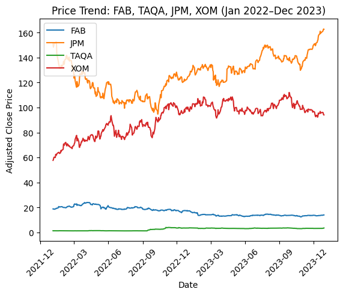

The line plot of daily closing prices highlights distinct market behaviors. U.S. stocks,JPMorgan Chase (JPM) and ExxonMobil (XOM),show clear fluctuations, showing global news sensitivity and investor thinking shifts. Their sharp peaks and dips correspond to periods of financial stress and oil market adjustments. In contrast, UAE stocks, First Abu Dhabi Bank (FAB) and TAQA, showcase steadier patterns, indicating a less reactive market. Overall, the figure portrays the U.S. market as dynamic and fast-paced, while the UAE demonstrates steady and conservative momentum.

---

### 2. Rolling Volatility Over Time

Rolling volatility measured over a 30-day window captures the changing risk patterns. Energy stocks (TAQA and XOM) experience sharp volatility spikes in early 2022, coinciding with the Russia–Ukraine war and energy supply shocks. Although volatility later subsides, both remain more unstable than banking stocks. JPM’s mid-2023 volatility bump aligns with the U.S. regional bank instability, while FAB remains calm and stable. This visualization reveals contrasting reactions: U.S. equities fluctuate dramatically with global uncertainty, whereas UAE equities maintain resilience through stable domestic policy.

---

### 3. Return Distribution

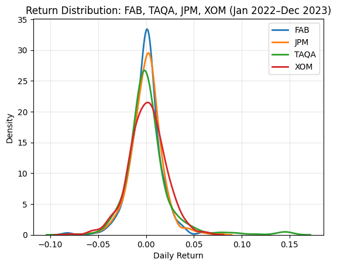

Histograms of daily returns show that most returns cluster near zero, forming nearly normal distributions. Energy stocks (TAQA, XOM) have broader spreads, meaning greater variability and risk. Banking stocks (FAB, JPM) display narrower shapes, implying steadier performance. The wider tails of TAQA and XOM reflect the higher uncertainty and price volatility during the global energy crisis, while FAB and JPM maintain compact, risk-controlled profiles. In sum, the distribution analysis confirms that energy trades with higher variance, while banking provides predictability and lower risk exposure.

---

### 4. Daily Return Distribution by Company

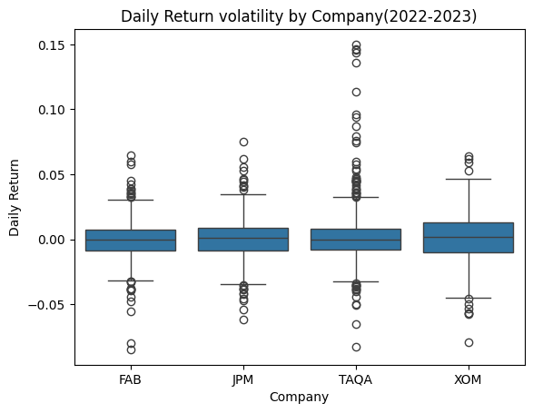

The boxplots visualize how each company’s daily returns vary. TAQA and XOM exhibit wider interquartile ranges and more outliers, capturing the volatility in the energy sector. FAB and JPM have smaller (in length) boxes and shorter whiskers, reflecting controlled, smaller daily price movements. U.S. companies show slightly broader variation overall, aligning with their higher responsiveness to international crises. The figure underscores the core insight: while both energy firms are volatile, geographic location increases the pattern, TAQA’s larger dispersion to stronger oil dependence within the UAE economy.

---

### 5. Correlations Between Sectors

#### Banking Sector Correlation

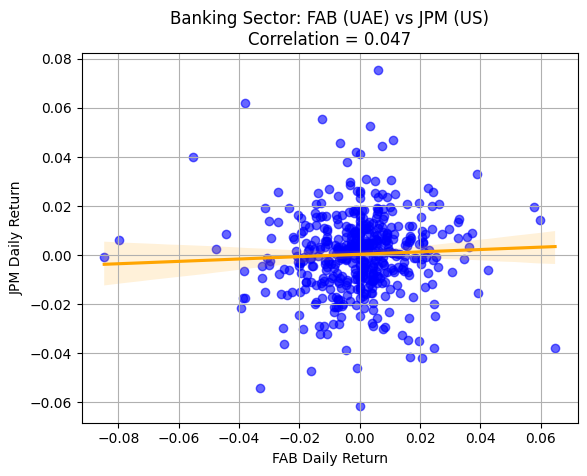

A scatter plot of FAB versus JPM daily returns reveals almost no linear relationship between the UAE and U.S. banking sectors. The cloud of points is spread, with only a slight positive slope. This means that movements in U.S. banking stocks do not significantly predict or mirror those in UAE banking, confirming that regional monetary and regulatory environments dominate domestic performance. It also suggests limited global integration between financial institutions across these markets.

#### Energy Sector Correlation

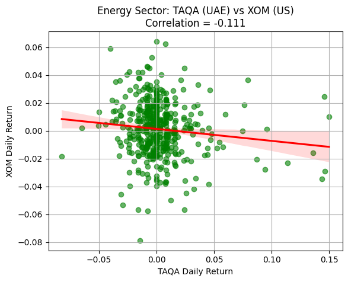

For the energy sector, TAQA and XOM show a weak negative correlation. While both operate in the same industry, differing national contexts drive their prices: TAQA’s performance is heavily influenced by regional production policies and government strategy, while XOM reacts to global oil benchmarks and U.S. supply-demand dynamics. The weak relationship implies that diversification across these companies can mitigate risk.

#### Cross-Sector UAE

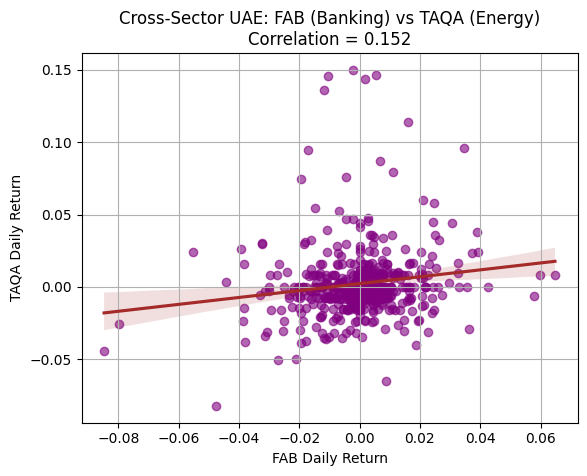

Within the UAE, FAB and TAQA exhibit almost no correlation, reflecting categorised market behavior. The financial sector and energy sector move independently due to differing regulatory indices and global relations. This independence suggests that UAE investors benefit from domestic diversification, as downturns in one sector do not necessarily affect the other.

#### Cross-Sector US

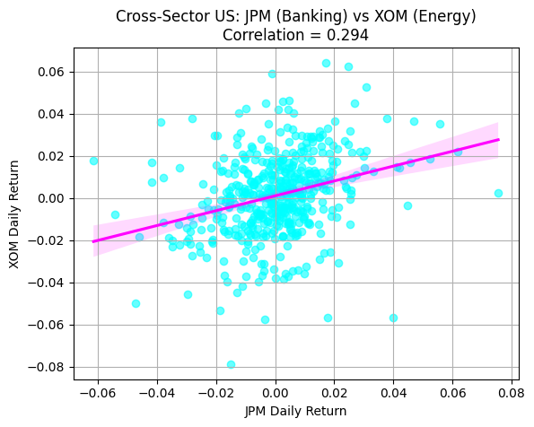

In the U.S., JPM and XOM share a modest positive correlation, indicating that both respond somewhat to macroeconomic conditions such as interest rate policy and inflation expectations. Although the relationship is not strong, the data reveal that the U.S. economy’s sectors tend to move more synchronously than those in the UAE.

---

### 6. Correlation Heatmap of Daily Returns

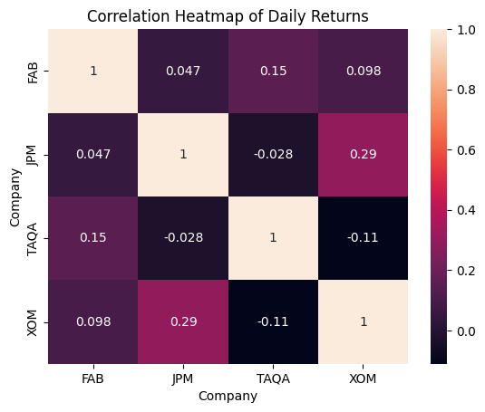

The heatmap shows the correlations between all four companies. Same-country pairs (FAB–TAQA and JPM–XOM) are weakly related, but still slightly stronger than cross-country pairs. FAB–JPM has a small positive relationship, while TAQA–XOM shows a small negative one. These low correlations suggest that the UAE and U.S. markets mostly move independently, which means they can provide good diversification when combined. The heatmap also shows that banking and energy behave differently even within the same country, since the two sectors are driven by different factors.

---

### 7. Average Daily Return by Company

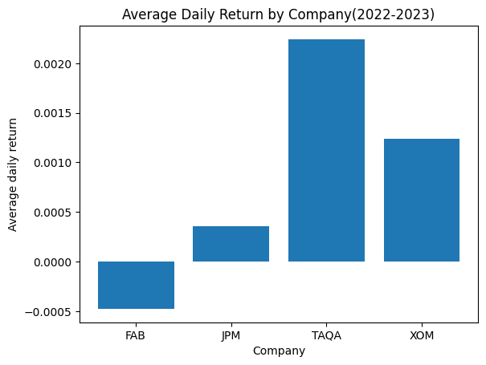

The average daily returns show a clear difference in performance between the companies. TAQA had the highest returns, followed by XOM, then JPM, while FAB was slightly negative. Energy stocks performed best, helped by high oil prices and strong demand in 2022–2023. Banking stocks grew more slowly during this period, especially in the UAE. TAQA’s strong results highlight how energy-focused economies benefited more from rising oil prices, while FAB’s negative return shows that the UAE banking sector struggled to grow during this time.

---

### 8. Daily Return Volatility by Company

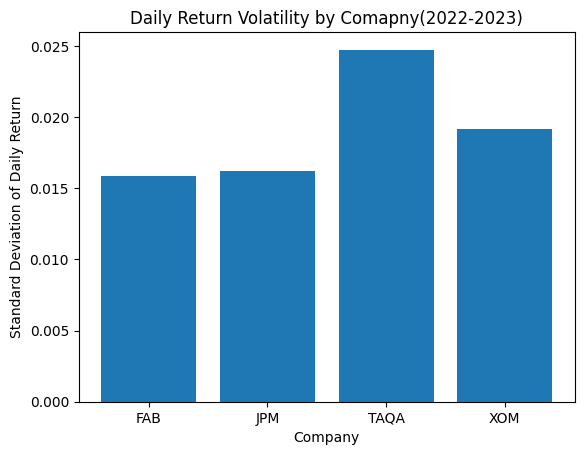

The standard deviation of returns shows how volatile each stock is. TAQA and XOM are the most volatile, which fits typical energy-sector behavior where prices react strongly to global events. FAB and JPM are more stable, with much smaller day-to-day movements. In both markets, energy is more volatile than banking, and TAQA is the most volatile overall, as the UAE market is more sensitive to changes in oil prices. This suggests that sector type, more than location, has the biggest influence on volatility.

---

### 9. Market Volatility (UAE vs US)

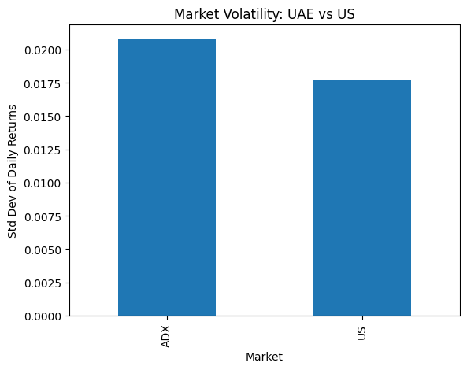

At the market level, ADX (UAE) shows slightly higher volatility (≈0.021) than the U.S. (≈0.018). This means that, overall, the UAE market experienced bigger day-to-day swings. Since the UAE market is strongly tied to energy, it reacts more to changes in oil prices, while the U.S. market is more balanced across different industries. This suggests that market composition, and which sectors dominate it, has a strong impact on overall volatility.

---

### 10. Number of Up vs Down Days

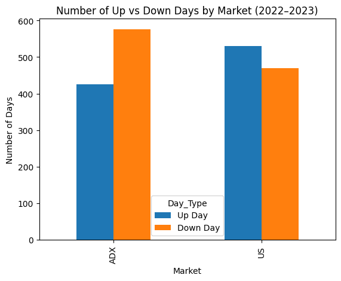

The bar chart above shows the number of Up vs Down trading days for each market. The U.S. had more Up Days in total, while the UAE had more Down Days. 
| Market | Day Type | Percentage |
|---------|-----------|------------|
| ADX     | Down      | 57.5%      |
| ADX     | Up        | 42.5%      |
| US      | Up        | 53.0%      |
| US      | Down      | 47.0%      |

The table above shows the same breakdown in percentages.According to Pandas calculations the U.S. market had more Up Days (53%) than Down Days (47%), while the UAE had more Down Days (57.5%) than Up Days (42.5%). This shows that the U.S. market was generally more positive during this period, while the UAE market was more mixed and often reacted to changes in oil prices. Overall, the chart suggests that U.S. investors showed more confidence, while the UAE market was more cautious and sensitive to global events.

---

### 11. Average Return by Sector and Market

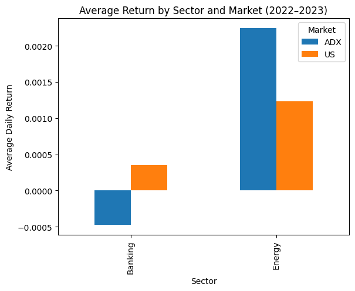

This chart compares the average daily return of Banking and Energy stocks across the UAE (ADX) and the US. Energy delivered higher returns in both markets, with ADX Energy leading overall, suggesting stronger sector performance in the UAE during this period. Meanwhile, Banking returns were weaker, and ADX Banking was slightly negative, reflecting slower growth and more stable investor gains in that sector.

---

### 12. Volatility by Sector and Market

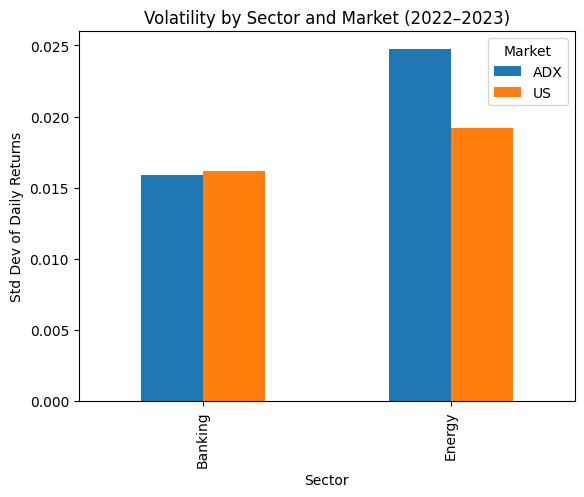

This chart shows the risk level of each sector by measuring return volatility. Energy is clearly more volatile than Banking in both markets, especially in the UAE, meaning energy prices moved more dramatically day-to-day. In contrast, Banking had lower and more similar volatility across ADX and the US, showing it behaved as a more stable, lower-risk sector in both regions.

---

## Conclusion

This comparison of the UAE and U.S. stock markets in 2022–2023 highlights two different market profiles. The U.S. market is more fast-moving and reacts quickly to global events, while the UAE market is steadier and shaped more by local policies. Energy stocks (TAQA and XOM) delivered the strongest returns but also showed the biggest price swings due to changes in oil prices. Meanwhile, banking stocks (FAB and JPM) were much more stable and helped limit risk during uncertain periods.

The U.S. saw more days of rising trades, driven by recovery after the pandemic and strong consumer confidence. In contrast, the UAE had more days of decline, showing caution and the impact of changes in global oil markets. Sector trends mattered more than geography: energy kept causing volatility and profit opportunities, while banking provided stability. The correlation findings showed that the UAE and U.S. markets move separately, confirming their value for diversification.

At the market level, ADX (UAE) shows slightly higher volatility (≈0.021) than the U.S.(≈0.018)(Graph 9). This means that, overall, the UAE market experienced bigger day-to-day swings. Since the UAE market is strongly tied to energy, it reacts more to fluctuations in oil prices, while the U.S. market is more balanced across different industries. This indicates that market composition and sector dominance, particularly the weight of energy stock-strongly influence overall volatility.

Interestingly, although the UAE market is usually more stable than the U.S., the strong performance and high volatility of TAQA (energy) dragged up overall market variability and even affected FAB (banking) through spillover effects within the ADX. In other words, TAQA’s oil-linked volatility exerted upward pressure on the perceived risk of the broader UAE market, making the ADX appear less stable than usual.

For investors, combining UAE and U.S. equities offers an effective balance: U.S. growth potential is complemented by UAE steadiness and income reliability. Ultimately, both markets showcase distinct strengths, the U.S. thrives through innovation and risk-taking, while the UAE endures through stability and strategic governance. Their coexistence underlines how market diversity sustains the global financial balance.

---

## Next Steps

**Add More Industries:** Expand the dataset by including additional sectors such as real estate, telecommunications, and consumer goods. This would give a fuller picture of how different parts of each economy move and whether the same patterns hold outside banking and energy.  
**Include More Markets:** Add new cities such as London, Tokyo, or Hong Kong to compare results across more financial centers. This could also be turned into a flexible framework where users can pick any two markets and run the same comparison to explore similarities and differences.  
**Add Volume and Liquidity Analysis:** Incorporating trading volume would help show how investor activity connects to market swings and volatility.  
**Compare Market Reactions Over Time:** Breaking the timeline into smaller periods (for example, first half vs. second half of 2023) could reveal how markets react differently to specific events or global shocks.

---

### References

- Abu Dhabi Securities Exchange (ADX): TAQA and FAB data (2022–2023)  
- Yahoo Finance API: JPMorgan Chase (JPM), ExxonMobil (XOM)  
- IMF *World Economic Outlook* (2023): Oil price and inflation trends  
- Bloomberg & Federal Reserve (2023): U.S. banking volatility  

---
